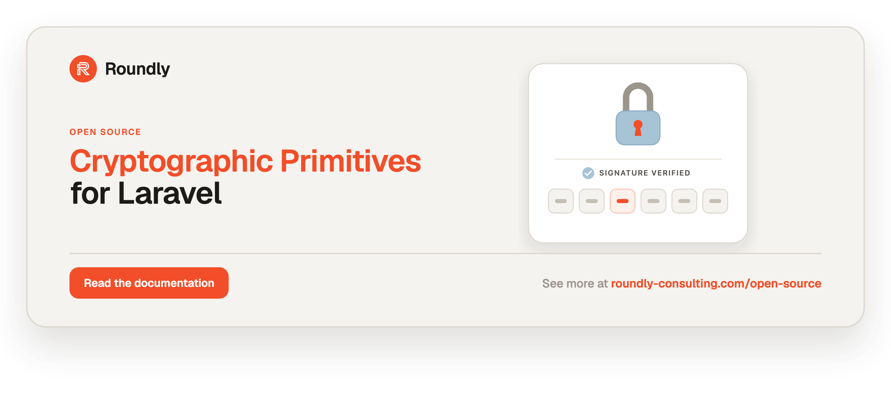

<!-- roundly-hero:start -->
<p align="center">
  <a href="https://roundly-consulting.com/open-source/docs/crypto-for-laravel?utm_source=github&utm_medium=readme&utm_campaign=open-source&utm_content=crypto-for-laravel">
    
  </a>
</p>
<!-- roundly-hero:end -->

<!-- roundly-badges:start -->
<p align="center">
  <a href="https://packagist.org/packages/roundly-consulting/crypto-for-laravel"></a>
  <a href="https://github.com/roundly-consulting/crypto-for-laravel/actions/workflows/run-tests.yml"></a>
  <a href="https://github.com/roundly-consulting/crypto-for-laravel/actions/workflows/fix-php-code-style-issues.yml"></a>
  <a href="https://donate.stripe.com/dRmeVe8FX5PF1Qd9pXcEw00"></a>
  <a href="https://www.patreon.com/cw/roundly"></a>
  <a href="https://roundly-consulting.com/support-us?utm_source=github&utm_medium=readme&utm_campaign=open-source&utm_content=crypto-for-laravel#crypto"></a>
</p>
<!-- roundly-badges:end -->

# Cryptographic Primitives for Laravel

Native, audited cryptographic and encoding primitives for Laravel — JWS/JOSE, TOTP/HOTP,
WebAuthn signature verification, HMAC, CSPRNG tokens, and codecs — with **zero third-party
crypto dependencies**. Every primitive is usable **à la carte**: reach for `Hmac` alone to
check a webhook, `Jws` alone for tokens, or `Totp` alone for one-time passwords, without
pulling in anything else.

- **JOSE / JWS** compact and flattened signing + strict verification across the whole SHA-2
  tier (HS256/384/512, RS256/384/512, ES256/384/512) plus EdDSA (Ed25519).
- **JWK** (RFC 7517) public-key serialization both ways, with **RFC 7638 thumbprints** — the
  value an ACME key authorization is built from — and a deliberately strict parser.
- **X.509** (RFC 5280) certificate and chain primitives: fingerprints, subject/issuer/SAN,
  validity dates, public keys, raw extensions, `x5c`/PEM/DER — facts only, **never a trust ruling**.
- **ASN.1 / DER** (X.690) a strict, canonical, bounded decoder — a parser, never a trust store.
- **RFC 4226 / RFC 6238** HOTP and TOTP built on `hash_hmac` and a native RFC 4648 base32 codec.
- **WebAuthn** COSE key parsing (P-256/P-384/P-521, RSA, Ed25519), a minimal defensive CBOR
  decoder, and signature verification.
- **HMAC** sign/verify, deterministic digests (with optional pepper), and constant-time compares.
- **CSPRNG** random bytes, URL-safe / numeric / alphanumeric tokens, and base32 secrets.
- **Codecs**: strict base64url, standard padded base64, base32 (RFC 4648), and hex.
- **Testing helpers**: ready-made ephemeral keys and known OTP vectors for consumer suites,
  plus opt-in Pest expectations — with no PHPUnit/Pest runtime dependency.
- **Zero-config**: no config file, no env keys — every key and knob is an explicit argument.

Parity with the RFCs and specs is proven by **committed test vectors** (RFC 4226 Appendix D,
RFC 6238 Appendix B, RFC 4231 HMAC-SHA384/512, RFC 7515 Appendix A.1/A.2, RFC 4648, and static
ES256/384/512 / RS256 / EdDSA COSE fixtures) — no external JOSE/JWT/TOTP/WebAuthn/CBOR library
is a dependency.

### Algorithm capability matrix

| Algorithm | Key type | Curve / digest | Sign | Verify | Notes |
|---|---|---|---|---|---|
| HS256 / HS384 / HS512 | `HmacSecret` | SHA-256/384/512 | ✅ | ✅ | secret ≥ 32 / 48 / 64 random bytes (the hash size, RFC 7518 §3.2) |
| RS256 / RS384 / RS512 | `RsaKey` | RSA ≥ 2048, SHA-256/384/512 | ✅ | ✅ | |
| ES256 / ES384 / ES512 | `EcKey` | P-256 / P-384 / P-521 | ✅ | ✅ | curve fixes the digest |
| EdDSA | `OkpKey` | Ed25519 | ✅¹ | ✅¹ | ¹ needs `ext-sodium` |

| Serialization | Type | Standard | Notes |
|---|---|---|---|
| JWK | `Jose\Jwk` | RFC 7517 / 7518 §6 / 8037 §2 | RSA, EC (P-256/384/521), OKP (Ed25519); public keys only |
| JWK thumbprint | `Jose\Jwk::thumbprint()` | RFC 7638 | SHA-256 by default; the ACME key-authorization input (RFC 8555 §8.1) |
| X.509 certificate | `X509\Certificate` | RFC 5280 / 7468 / 7515 §4.1.6 | PEM, DER, `x5c` base64; RSA + EC keys |
| X.509 chain | `X509\Chain` | RFC 5280 §6 (path *construction* only) | `isLinked()` proves the math — **not** path validation |
| DER | `Asn1\DerDecoder` | ITU-T X.690 (canonical DER) | strict: no indefinite lengths, no padded encodings, no trailing bytes |

The `Es` signer/verifier picks its digest and coordinate size from the key's own curve, so
there is no way to mismatch a curve against a tier. `Hs`/`Rs` take the tier as an argument
(`new Hs($secret, Algorithm::HS512)`, `new Rs($key, Algorithm::RS384)`); a verifier constructed
for one tier never verifies another. `Hs` refuses a secret shorter than its tier's hash output —
48 bytes for HS384, 64 for HS512 (`HmacSecret::generate(64)`) — with a `WeakKeyException`,
because verifiers that enforce RFC 7518 §3.2 reject every token such a key signs.

**Choosing an algorithm:** prefer **EdDSA** or **ES256** for new asymmetric tokens (small, fast);
use **RS256** for interop with systems that require RSA; use **HS256** only when both sides share
a secret. Pin the exact algorithm on `verify()` — the package never infers it from the token.

## Requirements

- PHP 8.4+
- Laravel 12 or 13
- Extensions: `ext-openssl`, `ext-hash`, `ext-mbstring` (required); `ext-sodium` (suggested —
  needed only for EdDSA / Ed25519 signing, verification, and key generation; it ships enabled by
  default on modern PHP).
- Runtime dependencies: Laravel/Symfony only, plus our own
  `roundly-consulting/package-toolkit-for-laravel` (the service-provider bootstrap toolkit).
  **No third-party crypto library is ever pulled in.**
- **Key generation** (`RsaKey::generate()`, `EcKey::generate()`) needs a usable OpenSSL
  configuration (`openssl.cnf`). Loading PEMs, signing, and verifying do not. On a host with a
  missing/broken config, `generate()` throws a typed `Signature\KeyLoadException` rather than
  leaking a PHP warning.

## Installation

```bash
composer require roundly-consulting/crypto-for-laravel
```

That's it. The package auto-registers a minimal, zero-config service provider — **there is no
config file to publish**, no migrations, and nothing to wire. Key material is always passed
explicitly at the call site.

## Design: zero-config, keys are arguments

This package ships **no config file**, never reads `env()`, and never resolves a key
implicitly for its own behaviour. Every secret, PEM, and OTP secret is a
`#[\SensitiveParameter]` argument, and every behavioural knob (hash algorithm, RSA bits, OTP
digits/period) is a constructor default or named argument. Your application (or another
package) owns configuration and wiring; this package owns the math and encoding.

The one deliberate exception is the opt-in `fromConfig()` key factories (see [Loading and
generating keys](#loading-and-generating-keys)). `HmacSecret::fromConfig('jwt.secret')` reads
**your** config key explicitly, at your call site — it is an accessor of the consumer's own
config, not the package configuring itself. An arch test enforces this precisely: `env()` is
banned everywhere, and `config()` is called **only** inside those `*FromConfig` factory
methods.

## Usage

### The `Crypto` facade

`Crypto` fronts the whole toolbox, so typing `Crypto::` shows every entry point. Every factory
still takes keys and knobs as explicit arguments, and the manager behind it holds no secret.

```php
use RoundlyConsulting\Crypto\Facades\Crypto;
use RoundlyConsulting\Crypto\Hash\HashAlgorithm;
use RoundlyConsulting\Crypto\Signature\Algorithm;

// Keys: every key family the signers take, loaded, generated or bootstrapped
$rsa    = Crypto::keys()->rsa()->privateFromStorage('local', 'keys/rsa.pem');
$rsaPub = Crypto::keys()->rsa()->publicFromConfig('jwt.public_key');
$ec     = Crypto::keys()->ec()->generate('P-384');
$ed     = Crypto::keys()->ed25519()->public($raw32Bytes);
$secret = Crypto::keys()->hmac()->fromConfig('services.webhook.secret');

// Signers and JOSE
$token  = Crypto::jws()->sign(['kid' => 'k1'], ['sub' => 'alice'], Crypto::rs($rsa));
$claims = Crypto::jws()->verify($token, Crypto::rs($rsaPub), Algorithm::RS256);
$sig    = Crypto::es($ec)->sign($message);               // raw r‖s, as JOSE wants it
$der    = Crypto::ecDer()->fromRaw($sig, 48);             // DER, as OpenSSL wants it
Crypto::verifier()->verify($publicKey, $message, $sig);   // the key picks the algorithm

// Hashing, OTP, JWK, X.509, COSE
Crypto::hmac(HashAlgorithm::Sha256)->verify($payload, $signature, $webhookKey);
Crypto::totp(digits: 8)->verify($otpSecret, $code);
Crypto::jwk($ec)->thumbprint();
Crypto::x509()->fromPem($pem)->fingerprint();
Crypto::x509()->chain()->fromX5c($x5c)->isLinked();      // the math — the trust call stays yours
Crypto::coseKey($coseBytes);                             // COSE_Key bytes -> a public key

// Randomness and codecs return the value directly
$code   = Crypto::random()->numeric(6);
$apiKey = Crypto::random()->token(40);
$b64u   = Crypto::base64UrlEncode($bytes);
```

Every method, by area:

| Area | Methods |
|---|---|
| JOSE / JWK | `jws()`, `jwk($key)`, `jwkFromArray($members)`, `jwkFromJson($json)` |
| Keys | `keys()->rsa()` / `->ec()` / `->ed25519()`: `public()`, `private()`, `generate()`, `publicFromStorage()`, `privateFromStorage()`, `publicFromConfig()`, `privateFromConfig()`, `fromStorageOrGenerate()`; plus `rsa()->fromModulusExponent()` and `ec()->fromCoordinates()` |
| HMAC secrets | `keys()->hmac()`: `fromString()`, `generate()`, `fromStorage()`, `fromConfig()`, `fromStorageOrGenerate()`; shortcut `generateHmacSecret($bytes)` |
| Signers | `hs($secret, $alg)`, `rs($key, $alg)`, `es($key)`, `eddsa($key)`, `verifier()` |
| ECDSA encoding | `ecDer()`: `fromRaw($rawRS, $coordBytes)`, `toRaw($der, $coordBytes)`, `isValid($der)` |
| X.509 | `x509()`: `fromPem()`, `fromDer()`, `fromBase64()`, `chain()` → `fromX5c()`, `fromPems()`, `fromPemBundle()`, `fromCertificates()`; shortcuts `certificate($pem)`, `chainFromX5c($x5c)`, `chainFromPemBundle($bundle)` |
| ASN.1 / DER | `derDecoder()` |
| Hashing | `hmac($alg)`, `digest($alg)`, `constantTimeEquals($known, $user)` |
| COSE / WebAuthn | `cbor()`, `coseKey($coseBytes)`, `authenticatorData($bytes)` |
| OTP | `totp($alg, $digits, $period)`, `hotp($alg, $digits)`, `provisioningUri($secret, $label, $issuer, …)` |
| CSPRNG | `random()`: `bytes()`, `token()`, `numeric()`, `alphanumeric()`, `fromAlphabet()`, `secret()`; shortcuts `randomBytes()`, `randomToken()`, `randomSecret()` |
| Codecs | `base64UrlEncode/Decode()`, `base64Encode/Decode()`, `base32Encode/Decode()`, `hexEncode/Decode()` |

The Ed25519 loaders use the same public/private words as RSA and EC: "public" is the raw 32-byte
key, "private" the 64-byte libsodium secret key. The shortcuts run through the sub-accessors, so
both spellings are the same code.

### Without the facade

The facade's root is `CryptoManager`, a container singleton. Inject it and you get the same API:

```php
use RoundlyConsulting\Crypto\CryptoManager;

final class IssueApiToken
{
    public function __construct(private CryptoManager $crypto) {}

    public function __invoke(): string
    {
        return $this->crypto->random()->token(48);
    }
}
```

Or skip both and call the classes the facade fronts. Each works on its own, and the core
factories need no container at all: `RsaKey::private($pem)`, `Token::numeric(6)`,
`Certificate::fromDer($der)`, `new Jws`. The sections below use this form.

There are **no action classes**. Crypto is stateless computation, and the convention lets that kind
of package expose plain service objects rather than one action per method.

### No `Crypto::fake()`, and why

The facade has nothing to fake: no database, queue, event, mail or HTTP call. Apart from
randomness and the key loaders, every call is a pure function of its arguments; for random output,
assert the shape rather than the value. The key loaders read your config or a disk, and
`fromStorageOrGenerate()` writes on first boot. That goes through Laravel's `Storage`, so
`Storage::fake('local')` already covers it. For ready-made keys and OTP vectors, see
[Testing helpers](#testing-helpers-testing).

### JWS / JOSE (`Jose\Jws`)

Sign and verify a compact JWS. Verification is deliberately strict: it enforces structure, an
8 KB size cap, a pre-signature algorithm pin (blocking `alg:none` and RS256↔HS256 confusion),
and `crit` rejection — nothing else. Temporal (`exp`/`nbf`/`iat`) checks are opt-in.

```php
use RoundlyConsulting\Crypto\Jose\Jws;
use RoundlyConsulting\Crypto\Signature\Algorithm;
use RoundlyConsulting\Crypto\Signature\Hs;
use RoundlyConsulting\Crypto\Signature\Key\HmacSecret;

$jws = new Jws;
$signer = new Hs(HmacSecret::fromString($secret)); // ≥32 random bytes

$token = $jws->sign(['kid' => 'k1'], ['sub' => 'alice', 'exp' => now()->addHour()->timestamp], $signer);

$claims = $jws->verify($token, $signer, Algorithm::HS256);
$claims->assertTemporal(leeway: 30);   // opt-in: throws if expired / not yet valid
$sub = $claims->string('sub');
```

The RSA and ECDSA tiers work the same way with `Rs`/`Es` and `RsaKey`/`EcKey`. Pick the tier on
the signer (RSA takes it as an argument; ECDSA reads it from the key's curve):

```php
use RoundlyConsulting\Crypto\Signature\Rs;
use RoundlyConsulting\Crypto\Signature\Es;
use RoundlyConsulting\Crypto\Signature\Key\RsaKey;
use RoundlyConsulting\Crypto\Signature\Key\EcKey;

$token  = $jws->sign([], ['sub' => 'bob', 'exp' => $exp], new Rs(RsaKey::private($privatePem), Algorithm::RS512));
$claims = $jws->verify($token, new Rs(RsaKey::public($publicPem), Algorithm::RS512), Algorithm::RS512);

// ES512 on a P-521 key — the curve fixes the digest:
$es = $jws->sign([], ['sub' => 'kim'], new Es(EcKey::private($p521Pem)));
$jws->verify($es, new Es(EcKey::public($p521PublicPem)), Algorithm::ES512);
```

EdDSA (Ed25519) can both sign and verify when `ext-sodium` is present:

```php
use RoundlyConsulting\Crypto\Signature\EdDSA;
use RoundlyConsulting\Crypto\Signature\Key\OkpKey;

$key = OkpKey::generate();                          // or OkpKey::fromSecretKey($sk)
$token = $jws->sign([], ['sub' => 'ed'], new EdDSA($key));
$jws->verify($token, new EdDSA(OkpKey::ed25519($key->publicKey)), Algorithm::EdDSA);
```

Flattened JWS (RFC 7515 §7.2.2, as used by ACME):

```php
$flattened = $jws->flattened(['nonce' => $nonce], $payloadJson, new Rs(RsaKey::private($privatePem)));
$wire = json_encode($flattened); // {"protected":"…","payload":"…","signature":"…"}
```

### HMAC webhooks (`Hash\Hmac`)

```php
use RoundlyConsulting\Crypto\Hash\Hmac;
use RoundlyConsulting\Crypto\Hash\HashAlgorithm;

$hmac = new Hmac(HashAlgorithm::Sha256);

// GitHub-style "sha256=…" header check:
$expected = 'sha256='.$hmac->signHex($request->getContent(), $webhookSecret);
$ok = hash_equals($expected, $request->header('X-Hub-Signature-256', ''));

// Or verify raw signatures directly (constant-time):
$ok = $hmac->verify($payload, $signature, $webhookSecret);
```

### TOTP / HOTP (`Otp\Totp`, `Otp\Hotp`)

```php
use RoundlyConsulting\Crypto\Otp\Totp;
use RoundlyConsulting\Crypto\Otp\ProvisioningUri;
use RoundlyConsulting\Crypto\Random\Secret;

$secret = Secret::base32(32);                     // enrol
$uri = ProvisioningUri::totp($secret, 'alice@example.com', 'Acme Inc');

$totp = new Totp;                                 // SHA1, 6 digits, 30s (default profile)
$code = $totp->codeAt($secret);
$matchedStep = $totp->verify($secret, $userCode); // int|false, timing-flat, drift window
```

Custom profiles use named/positional arguments: `new Totp(OtpAlgorithm::Sha256, digits: 8, period: 60)`.

### JWK & thumbprints (`Jose\Jwk`)

A JWK is a public key's JSON form (RFC 7517). `Jwk` goes **both ways**, and its RFC 7638
thumbprint is what an ACME key authorization is built from.

```php
use RoundlyConsulting\Crypto\Jose\Jwk;
use RoundlyConsulting\Crypto\Signature\Key\EcKey;

$jwk = Jwk::fromPublicKey(EcKey::private($pem));   // a P-384 key ⇒ crv P-384, 48-byte coordinates

$jwk->algorithm();          // Algorithm::ES384 — derived from kty + crv, never read from `alg`
$jwk->thumbprint();         // base64url(sha256(canonical JSON)) — RFC 7638
$keyAuthorization = $token.'.'.$jwk->thumbprint();          // RFC 8555 §8.1

// It is JsonSerializable, so it drops straight into a JOSE protected header:
$protected = ['alg' => $jwk->algorithm()->value, 'jwk' => $jwk, 'nonce' => $nonce, 'url' => $url];

// …and back again, into a policy-checked verification key:
$key = Jwk::fromJson($json)->publicKey();          // EcKey | RsaKey | OkpKey
```

Optional members (`kid`, `alg`, `use`) are carried in `toArray()` but **never** thumbprinted:
`$jwk->withKid('k1')->thumbprint()` is unchanged.

An RSA key fits every RS* tier, so an RSA JWK's `alg` (`RS256`, `RS384` or `RS512`) names the
tier and `algorithm()` returns it — `RS256` when the member is absent. Verify with that tier:
`new Rs($jwk->publicKey(), $jwk->algorithm())`. Any other `alg` on an RSA key (`ES256`, `HS256`,
`PS256`, `none`) is still refused.

**Parsing is strict, on purpose.** RFC 7517 says unknown members *should* be ignored; this
package **rejects** them, because its callers round-trip documents this fleet mints, and a
member you silently carry is a member an attacker chose. Rejected: unknown members (`x5c`,
`key_ops`, …), any private member (`d`, `p`, `q`, `dp`, `dq`, `qi`, `oth`, `k`), non-base64url
values, coordinates whose length contradicts the stated `crv`, a non-minimal RSA `n`/`e`, an
`alg` that does not match the key, a `use` other than `sig`, and documents over 16 KiB
(members over 8 KiB are refused *before* they are decoded). Everything throws
`MalformedJwkException`, whose message names the member and the reason.

### X.509 certificates & chains (`X509\*`)

```php
use RoundlyConsulting\Crypto\Hash\HashAlgorithm;
use RoundlyConsulting\Crypto\X509\Certificate;
use RoundlyConsulting\Crypto\X509\Chain;

$certificate = Certificate::fromPem($pem);        // also fromDer(), fromBase64() for an x5c entry

$certificate->commonName();                       // 'app.example'
$certificate->dnsNames();                         // ['app.example', '*.api.example']
$certificate->fingerprint();                      // lower-case sha256 hex, as openssl emits it
$certificate->notAfter();                         // CarbonImmutable
$certificate->publicKey();                        // RsaKey | EcKey — policy-checked
$certificate->isSignedBy($issuer);                // an ALGORITHM question

// A JOSE x5c chain (leaf first), or a concatenated PEM bundle:
$chain = Chain::fromX5c($x5c);                    // ≤ 10 certificates, strict base64, typed errors

$chain->isLinked();                               // every cert is signed by the next one up
$chain->fingerprints(HashAlgorithm::Sha1);        // leaf → root
$chain->leaf()->publicKey();
```

On the facade: `Crypto::x509()->fromPem()` / `fromDer()` / `fromBase64()`, and
`Crypto::x509()->chain()->fromX5c()` / `fromPems()` / `fromPemBundle()` / `fromCertificates()`.

Validity is reported as **dates**, with a symmetric clock-skew leeway you own:

```php
$certificate->isValidAt();                                  // now (honours Carbon::setTestNow)
$certificate->isValidAt($token->signedAt, leewaySeconds: 60);
$certificate->isExpiredAt(leewaySeconds: 60);              // distinct from a bad signature
$certificate->isNotYetValidAt();                            // a negative leeway throws
```

> **Crypto proves the math; deciding what to trust is yours.** There is no `isTrusted()`, no
> pinning, no root store, no revocation, and no hostname matching in this package — by design,
> and enforced by an architecture test. `Chain::isLinked()` says *these certificates sign each
> other*; it does **not** say the last one is an authority you have ever heard of. Pin your own
> anchors, and decide for yourself what an expired certificate means.

### ASN.1 / DER (`Asn1\*`)

A strict X.690 reader — the CBOR decoder's counterpart for the other encoding certificates
arrive in. It exists because `openssl_x509_parse()` pretty-prints unknown extensions into lossy
text, so anything that needs an extension's actual **bytes** needs a real DER walk:

```php
use RoundlyConsulting\Crypto\Asn1\DerDecoder;

// The Apple WebAuthn nonce extension: SEQUENCE { [1] { OCTET STRING nonce } }
$element = (new DerDecoder)->decode($certificate->extension('1.2.840.113635.100.8.2')?->der ?? '');

$nonce = $element->tagged(1)?->children()[0]->octetString();

$element->children();          // list<DerElement>, in encoding order
$element->oid();               // '1.2.840.113635.100.8.2' — dotted decimal
$element->integer();           // int, or raw bytes when wider than 64 bits
$element->boolean();           // DER's 0x00 / 0xFF only
$element->isNull();

(new DerDecoder)->decodeFirst($bytes);   // element + bytesRead, for walking a run of TLVs
```

Everything hostile is a `MalformedDerException`, never a warning: indefinite lengths (that is
BER), non-minimal length or tag encodings, padded INTEGERs and OID subidentifiers, BER-lax
BOOLEANs, a declared length past the end of the buffer, trailing bytes after the top-level
element, and a constructed/primitive form mismatch. Work is bounded three ways — 64 KiB of
input, 16 levels of nesting, 4096 elements — so a nested-SEQUENCE bomb costs an exception
rather than the stack.

> **A parser, never a trust store.** `DerDecoder` turns bytes into structure and stops there. It
> does not know what a certificate extension, an attestation, or an authority is — what an
> extension's contents *mean* is your call, made in your code.

### WebAuthn signature verification (`Cose\*`, `Signature\KeyVerifier`)

```php
use RoundlyConsulting\Crypto\Cose\AuthenticatorData;
use RoundlyConsulting\Crypto\Cose\CoseKey;
use RoundlyConsulting\Crypto\Signature\KeyVerifier;

$authData = AuthenticatorData::parse($rawAuthenticatorData);      // rpIdHash, flags, signCount, COSE key
$key = CoseKey::fromCbor($coseBytes);                             // COSE_Key bytes -> a verifiable public key

$ok = (new KeyVerifier)->verify($key, $signedData, $signature);   // ES256 DER or raw, RS256, EdDSA
```

`CoseKey::fromCbor()` takes the COSE_Key **bytes** (a stored credential key, or
`$authData->coseKeyBytes`), not a decoded array: a PHP string cannot say whether CBOR carried it as
a byte string or a text string, and a strict COSE reader refuses a text-typed `x`/`y`/`n`/`e`. The
`CborDecoder` itself refuses a text string that is not UTF-8 and a text map key PHP would store as
an integer (`"1"`, `"-1"`), so a text label can never pass for the integer label it imitates.

The ceremony (challenge binding, origin, rpId hash, flag policy, sign-count reconciliation)
stays in your relying-party code; this package only decodes bytes and checks signatures.

### CSPRNG (`Random\*`)

```php
use RoundlyConsulting\Crypto\Random\Bytes;
use RoundlyConsulting\Crypto\Random\Token;

$bytes = Bytes::generate(32);
$token = Token::urlSafe(40);                 // base64url, ≥32 chars
$digits = Token::numeric(6);                 // digits only (numeric OTP / recovery code)
$alnum  = Token::alphanumeric(24);           // 0-9A-Za-z
$code   = Token::fromAlphabet('ABCDEFGHJKMNPQRSTUVWXYZ23456789', 10);
```

`fromAlphabet()` takes UTF-8 text and draws whole characters, so a multibyte alphabet
(`'äöü'`, emoji) yields valid UTF-8 of exactly the requested number of characters; an alphabet
that is not valid UTF-8 throws `InvalidLengthException`.

The facade groups the same helpers under `Crypto::random()`: `bytes(32)`, `token(40)`,
`numeric(6)`, `alphanumeric(24)`, `fromAlphabet($alphabet, 10)` and `secret(32)` (base32, for TOTP).

`Secret::base32($chars)` (and `secret()` / `randomSecret()`) always returns a secret that `Totp`,
`Hotp` and `Base32::decode()` accept. A length of 1, 3 or 6 (mod 8) has no canonical base32 form,
so such a request rounds **up** one character (`17` → 18 chars); every other length is exact.

### Codecs (`Codec\*`)

```php
use RoundlyConsulting\Crypto\Codec\Base64Url;
use RoundlyConsulting\Crypto\Codec\Base64;
use RoundlyConsulting\Crypto\Codec\Base32;
use RoundlyConsulting\Crypto\Codec\Hex;

$encoded = Base64Url::encode($bytes);        // unpadded, URL-safe
$bytes   = Base64Url::decode($encoded);      // STRICT: rejects +, /, =, and non-alphabet

$padded  = Base64::encode($bytes);           // standard padded base64 (+/ alphabet, = padding)
$bytes   = Base64::decode($padded);          // STRICT: rejects non-canonical / non-alphabet
```

### Testing helpers (`Testing\*`)

Consumer test suites can pull ready-made key material and known OTP vectors instead of
hand-rolling them. These ship in `src/` but import no PHPUnit/Pest symbol:

```php
use RoundlyConsulting\Crypto\Testing\TestKeys;
use RoundlyConsulting\Crypto\Testing\TestOtp;

$secret = TestKeys::hmacSecret();      // a fixed, valid 64-byte secret (every HS tier)
$rsa    = TestKeys::rsa();             // ephemeral 2048-bit private key
$ec     = TestKeys::ec('P-384');       // ephemeral EC private key
$okp    = TestKeys::ed25519();         // ephemeral Ed25519 (guard on TestKeys::supportsEd25519())

$code = TestOtp::codeAt(time());       // a valid TOTP code for TestOtp::SECRET
```

`TestCertificates` does the same for X.509, so no suite has to hand-roll CSRs, CA extensions,
and an `openssl.cnf` that actually carries the sections it needs — it writes its own:

```php
use RoundlyConsulting\Crypto\Testing\TestCertificates;

$ca = TestCertificates::chain();                  // leaf → intermediate → root, genuinely linked
$ca->leafKey;                                     // the leaf's PRIVATE key — sign your test token with it
$ca->x5c();                                       // ready to drop into a JWS `x5c` header
$ca->pinnedFingerprints();                        // the [intermediate, root] slice a pinning verifier compares
$ca->pemBundle();

$rogue = TestCertificates::rogueLeaf($ca);        // same subject, a different CA — breaks isLinked()
$self  = TestCertificates::selfSigned(['app.test']);
```

`ext-openssl` always stamps `notBefore` at signing time, so expired / not-yet-valid scenarios
are produced by evaluating at another instant (`isExpiredAt($leaf->notAfter()->addDay())`, or
under `CarbonImmutable::setTestNow()`) rather than by backdating a certificate.

Optional Pest expectations are shipped as an **opt-in, non-autoloaded** file — `require` it from
your own `tests/Pest.php` (guarded by `function_exists('expect')`, so it never loads at runtime):

```php
// tests/Pest.php
require dirname(__DIR__).'/vendor/roundly-consulting/crypto-for-laravel/src/Testing/pest-expectations.php';

expect($token)->toBeValidJws($verifier, Algorithm::RS256);
expect($code)->toBeValidTotp($secret);
expect($ca->chain)->toBeLinked();                     // the math, not trust
expect($ca->leaf())->toBeSignedBy($ca->chain->get(1));  // the intermediate signed the leaf
expect($ca->chain->get(1))->toBeSignedBy($ca->root());
expect($jwk)->toHaveThumbprint('NzbLsXh8uDCcd-6MNwXF4W_7noWXFZAfHkxZsRGC9Xs');
```

## Loading and generating keys

Every key/secret class has a core zero-config factory — `HmacSecret::fromString()`,
`RsaKey::public()`/`private()`, `EcKey::public()`/`private()`, `OkpKey::ed25519()`/
`fromSecretKey()` — that needs no container, no config, and no disk. On top of those, each
class adds opt-in **Laravel-native loaders** that read the material from a filesystem disk or
from your own config key, plus **generators** so you never have to hand-roll a CSPRNG.

Every loader validates with the exact same guards as the core factory (HMAC ≥ 32 random
bytes and PEM-reject, RSA ≥ 2048, EC curve checks, Ed25519 length), and a missing file (whether
the disk returns `null` or is configured with `'throw' => true`), an unknown disk name, a
failed write in `fromStorageOrGenerate()`, or a missing/empty/non-string config value throws a
typed `Signature\KeyLoadException` — never a PHP warning, and never a filesystem exception
(the original stays on `getPrevious()`).

The PEM factories — `RsaKey`/`EcKey` `public()`/`private()`, `Certificate::fromPem()`,
`Chain::fromPems()` — take PEM **text**, never a path: a `file://…` string (which PHP's OpenSSL
functions would read from disk) is refused as unreadable. Load files through `fromStorage()`.

Each factory below is also on the facade, under `Crypto::keys()`, with the same arguments:
`Crypto::keys()->rsa()->privateFromStorage('local', 'keys/rsa.pem')`,
`Crypto::keys()->hmac()->fromStorageOrGenerate('local', 'keys/hmac.key')`, and so on. For
Ed25519, `OkpKey::ed25519*()` becomes `Crypto::keys()->ed25519()->public*()` and
`OkpKey::fromSecretKey()` / `secretKeyFrom*()` becomes `->private*()`.

```php
use RoundlyConsulting\Crypto\Signature\Key\HmacSecret;
use RoundlyConsulting\Crypto\Signature\Key\RsaKey;
use RoundlyConsulting\Crypto\Signature\Key\EcKey;
use RoundlyConsulting\Crypto\Signature\Key\OkpKey;

// From a filesystem disk (any configured disk name):
$secret = HmacSecret::fromStorage('local', 'keys/hmac.key');
$rsa    = RsaKey::privateFromStorage('local', 'keys/rsa.pem');
$rsaPub = RsaKey::publicFromStorage('local', 'keys/rsa.pub');
$ec     = EcKey::privateFromStorage('local', 'keys/ec.pem');
$okp    = OkpKey::ed25519FromStorage('local', 'keys/ed25519.pub'); // 32 raw bytes

// From YOUR config key (explicit — the package reads no config on its own):
$secret = HmacSecret::fromConfig('services.webhook.secret');
$rsa    = RsaKey::privateFromConfig('jwt.private_key');
$ecPub  = EcKey::publicFromConfig('tokens.public_key');
```

Generate fresh material:

```php
$secret = HmacSecret::generate();      // 32 random bytes (≥256 bits); pass a larger byte count if you like
$rsa    = RsaKey::generate(2048);      // or 3072 / 4096
$ec     = EcKey::generate('P-256');    // or P-384 / P-521
$okp    = OkpKey::generate();          // Ed25519, needs ext-sodium
```

### Load, or generate-and-persist on first boot

`fromStorageOrGenerate()` loads the key from a disk path, or — when the file is **missing** —
generates a fresh one, writes it to that path with private visibility, and returns it. An
existing-but-invalid file is **never** overwritten; it still throws. For the asymmetric keys
the persisted artifact is the **private** PEM (Ed25519 persists the 64-byte secret); derive
and persist the public side yourself with `publicPem()`.

```php
// Bootstraps a secret on first run, reuses it forever after:
$secret = HmacSecret::fromStorageOrGenerate('local', 'keys/hmac.key');

// Asymmetric: private PEM is written; persist the public half alongside it:
$key = RsaKey::fromStorageOrGenerate('local', 'keys/rsa.pem', bits: 3072);
Storage::disk('local')->put('keys/rsa.pub', $key->publicPem(), 'private');

$ec  = EcKey::fromStorageOrGenerate('local', 'keys/ec.pem', curve: 'P-384');
$okp = OkpKey::fromStorageOrGenerate('local', 'keys/ed25519.key'); // 64-byte secret, ext-sodium
```

Storing keys somewhere other than a Laravel disk? `RsaKey` and `EcKey` export both halves —
`privatePem()` for the private (PKCS#8) PEM and `publicPem()` for the public (SPKI) one:

```php
$key = RsaKey::generate(2048);

file_put_contents('/etc/app/private.pem', $key->privatePem()); // secret — chmod 0600
file_put_contents('/etc/app/public.pem', $key->publicPem());
```

`privatePem()` throws `KeyLoadException::notPrivate()` on a **public** key, so a verify-only key
can never be mistaken for signing material.

On the facade, `Crypto::keys()->hmac()->generate(48)` (or its shortcut
`Crypto::generateHmacSecret(48)`) returns the secret without ever caching it.

## Wiring your own keyed provider

Because this package is zero-config, a keyed signer lives in **your** service provider, built
from **your** config — the crypto package never sees where your key comes from:

```php
use Illuminate\Support\ServiceProvider;
use RoundlyConsulting\Crypto\Signature\Hs;
use RoundlyConsulting\Crypto\Signature\Key\HmacSecret;

final class TokensServiceProvider extends ServiceProvider
{
    public function register(): void
    {
        $this->app->singleton(Hs::class, fn () => new Hs(
            HmacSecret::fromString(config('tokens.secret')),
        ));
    }
}
```

Or lean on the opt-in loaders so the wiring reads straight from your config or disk — and, if
you want zero setup, bootstraps a secret on first boot:

```php
$this->app->singleton(Hs::class, fn () => new Hs(
    HmacSecret::fromConfig('tokens.secret'),
));

// self-bootstrapping variant — generates + persists the secret on first run:
$this->app->singleton(Hs::class, fn () => new Hs(
    HmacSecret::fromStorageOrGenerate('local', 'keys/tokens.key'),
));
```

## Exceptions

Everything throws a subtype of `RoundlyConsulting\Crypto\Exceptions\CryptoException`, so you can
catch broadly or precisely and re-wrap at your boundary — e.g.
`Codec\InvalidEncodingException`, `Signature\InvalidSignatureException`,
`Signature\AlgorithmMismatchException`, `Signature\WeakKeyException`,
`Jose\MalformedTokenException`, `Jose\MalformedJwkException`, `Cose\MalformedCborException`,
`Cose\UnsupportedAlgorithmException`, `Otp\InvalidOtpParameterException`, and — for X.509 —
`X509\MalformedCertificateException`, `X509\InvalidChainException`, and
`X509\InvalidLeewayException`.

## Testing

```bash
composer test
```

## Changelog

See [CHANGELOG.md](CHANGELOG.md) for recent changes.

<!-- roundly-support:start -->
## Support our work

This package is free and open source, built and maintained by
[Roundly Consulting](https://roundly-consulting.com/open-source?utm_source=github&utm_medium=readme&utm_campaign=open-source&utm_content=crypto-for-laravel).
If it saves you time, please consider supporting our open-source work — a one-time donation, a
monthly pledge on Patreon or a crypto donation helps fund maintenance, new features and new
packages.

<a href="https://donate.stripe.com/dRmeVe8FX5PF1Qd9pXcEw00"></a>
<a href="https://www.patreon.com/cw/roundly"></a>
<a href="https://roundly-consulting.com/support-us?utm_source=github&utm_medium=readme&utm_campaign=open-source&utm_content=crypto-for-laravel#crypto"></a>
<!-- roundly-support:end -->

## License

The MIT License (MIT). See [LICENSE.md](LICENSE.md).
